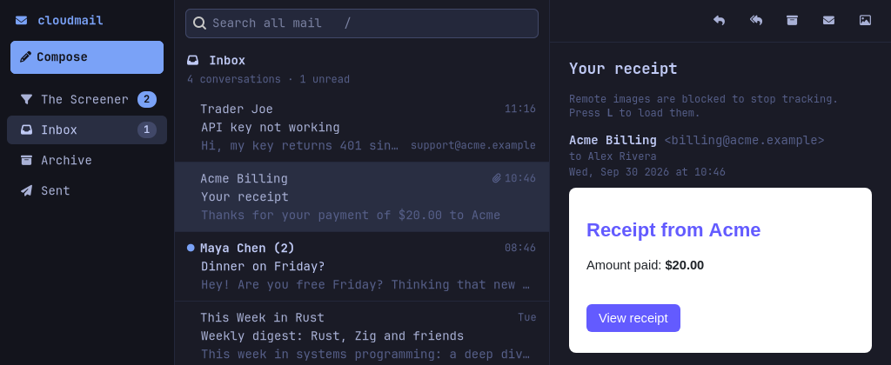
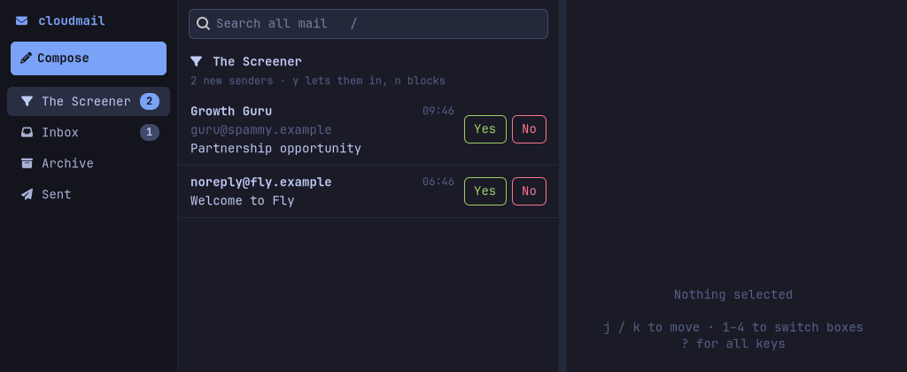

# Cloudmail

Email on your own domains that runs entirely in your own Cloudflare account. It has a
HEY-style **Screener**, a fast native Linux app, and a CLI that AI agents can drive without
any special setup.

**Screened email · native Linux app · agent-friendly CLI · no mail server.**

<sub>Not affiliated with [maillab/cloud-mail](https://github.com/maillab/cloud-mail) ("Cloud Mail")
or [CloudMailin](https://www.cloudmailin.com). Different projects that happen to have similar names.</sub>

<p align="center">
  
  
</p>

## Who it's for

- You own a domain whose DNS is on Cloudflare, and you want its mail out of Google Workspace,
  Fastmail and the like, without running Postfix on a server.
- You're on Omarchy or another Arch Linux desktop and want a keyboard-first mail app that
  follows your theme. The CLI runs on other Linux systems too.
- You want an inbox your scripts or your local AI agent can read and answer through a plain
  CLI, without a Gmail API project.
- You like HEY's Screener and want it on your own domain, in your own account.

## How it works

```
sender ─SMTP─▶ Email Routing ─▶ Worker email() ─▶ D1 (threads, messages, search) + R2 (raw mail, attachments)
cloudmail / cloudmail-gtk ─HTTPS + token─▶ Worker /api/* ─▶ Email Service (outgoing mail)
```

- **Receive** with Cloudflare Email Routing, **send** with Cloudflare Email Service. No mail server,
  no IMAP, nothing to patch.
- **Your data stays in your account**: messages in D1 (with full-text search), raw `.eml` files and
  attachments in R2. Nothing goes through a service I run.
- **The Screener**: the first email from someone new waits for a yes or no. Yes, and their mail goes
  to your Inbox from then on. No, and you never hear from them again. People you email are screened
  in automatically. If the sender's domain didn't authenticate a message (DMARC, or aligned
  DKIM/SPF when the domain has no DMARC policy), that message can't ride on an earlier approval.
- **Several domains, one inbox.** Personal addresses are screened. Role addresses like `support@`
  deliver straight to the Inbox. Replies go out from the address the mail was sent to.
- **Inbox and Archive**, that's it. A reply on an archived thread brings it back.
- **Privacy by default**: remote images and tracking pixels stay blocked until you ask for them.

| Path | What |
|---|---|
| `worker/` | Cloudflare Worker (TypeScript): inbound handler, Screener, JSON API |
| `crates/cloudmail` | `cloudmail` CLI |
| `crates/cloudmail-gtk` | `cloudmail-gtk` desktop app (GTK4 + WebKitGTK), themed from Omarchy if present |
| `crates/cloudmail-api` | Rust API client shared by both, plus linked accounts (HEY through the `hey` CLI, Gmail through Google's `gws` CLI, iCloud Mail through icloud-session) |
| `docs/API.md` | HTTP API reference |

## What you need

- A domain whose DNS is on Cloudflare.
- A Cloudflare account. Receiving works on the free plan. To send to anyone you need the Workers
  Paid plan (about $5/month, with 3,000 emails/month included).
- For the desktop app: Omarchy or another Arch Linux desktop (x86_64 and aarch64 packages), or
  GTK 4.16+ and WebKitGTK 6.0 if you build it yourself.
- A keyring (GNOME Keyring, KeePassXC or any other Secret Service): Cloudmail keeps its API token
  there and nowhere else. Omarchy and most Linux desktops have one.
- Node.js/npm on the machine where you run `cloudmail setup`. It deploys the worker with
  Cloudflare's `cf` CLI.

## Install

**Omarchy or any Arch Linux (x86_64 and aarch64):**

```sh
curl -fsSL https://ferdousbhai.com/cloudmail/install.sh | sudo bash
```

This trusts Cloudmail's package-signing key (checked against the pinned fingerprint
`35C47A06567940B6796B4D0F9B3C7BDF85268B31`), adds the signed pacman repository for your
architecture (`[cloudmail]` on x86_64, `[cloudmail-aarch64]` on ARM), and installs `cloudmail` and
`npm`. On Omarchy it also adds a hook so the repository survives `omarchy refresh pacman`. Updates
arrive with `omarchy update` (or `pacman -Syu`). The script is
[`packaging/repo/install.sh`](packaging/repo/install.sh), if you'd rather read it first or do the
same steps by hand:

```sh
repo=cloudmail; [ "$(uname -m)" = aarch64 ] && repo=cloudmail-aarch64
release=https://github.com/ferdousbhai/cloud-mail/releases/latest/download
curl -fsSLO "$release/$repo-signing-key.asc"
gpg --show-keys "$repo-signing-key.asc"       # must show 35C47A06567940B6796B4D0F9B3C7BDF85268B31
sudo pacman-key --add "$repo-signing-key.asc"
sudo pacman-key --lsign-key 35C47A06567940B6796B4D0F9B3C7BDF85268B31
printf '[%s]\nSigLevel = Required DatabaseRequired\nServer = %s\n' "$repo" "$release" \
  | sudo tee "/etc/pacman.d/$repo.conf"
echo "Include = /etc/pacman.d/$repo.conf" | sudo tee -a /etc/pacman.conf
sudo pacman -Syu cloudmail npm                # on Omarchy: omarchy pkg add cloudmail npm
```

Cloudmail is also on its way into Omarchy's own repository and *Install › Service* menu
([omarchy-pkgs#724](https://github.com/omacom/omarchy-pkgs/pull/724),
[omarchy#13763](https://github.com/omacom/omarchy/pull/13763)). Until those are merged, use the
commands above.

**Just the CLI, on other Linux systems:** each release after v0.5.0 has prebuilt `cloudmail`
archives attached (x86_64 and aarch64, statically linked), with a `SHA256SUMS` file. Each archive
holds the `cloudmail` binary and the `worker/` source that `cloudmail setup` deploys. Put the
binary on your `PATH` and keep the unpacked folder: run `cloudmail setup` from inside it (it
deploys the `worker/` it finds there), or pass `--worker-dir path/to/worker`.

With Rust installed you can build the CLI instead. Run `cloudmail setup` from a clone, because
that's where `worker/` lives:

```sh
cargo install --locked --git https://github.com/ferdousbhai/cloud-mail cloudmail
```

### From source

You need Rust **1.88 or newer** for the CLI and **1.92 or newer** for the desktop app, plus
Node.js. The desktop app also needs GTK 4.16 or newer and WebKitGTK 6.0 (`./install.sh` installs
them on Arch; Debian 13: `apt install libgtk-4-dev libwebkitgtk-6.0-dev`).

```sh
git clone https://github.com/ferdousbhai/cloud-mail && cd cloud-mail
./install.sh                    # installs cloudmail (alias: cmail) + cloudmail-gtk to ~/.local/bin
# CLOUDMAIL_NO_GTK=1 ./install.sh   # CLI only
```

## Set it up

```sh
cloudmail setup you@yourdomain.com
```

`setup` logs you in to Cloudflare in your browser, deploys your mail service to your account
(a Worker, a D1 database and an R2 bucket), turns on receiving and sending for your domain, and
connects the app, keeping its API token in your keyring (GNOME Keyring, or any Secret Service).
Open **Cloudmail** from the app launcher.

- Several addresses and domains: `cloudmail setup you@a.com support@a.com:direct hello@b.com`.
  `:direct` skips the Screener (good for `support@`, `legal@`, …).
- If a domain already receives mail somewhere else (Google Workspace, Fastmail, …), setup tells you
  where and asks before moving it, because that replaces the domain's MX records.
- `--forward-to me@gmail.com` keeps a copy of everything going to your old inbox while you switch.
  Cloudflare emails that address a link to confirm it. Turn it off later with
  `cloudmail settings set forward-to ""`.
- `--dry-run` shows every step first. Running setup again is safe, and is how you update the
  worker after an upgrade.
- Sending adds SPF/DKIM records and a `p=reject` DMARC record to the domain. If another service
  sends mail as that domain, set it up with SPF/DKIM first.

Add addresses later with `cloudmail mailbox add sales@yourdomain.com --route`.

**For agents and scripts**, setup never prompts when output is piped. Give it a Cloudflare API token
instead of the browser login, and `--yes` to allow moving a domain's mail:

```sh
CLOUDFLARE_API_TOKEN=… cloudmail setup you@yourdomain.com --yes
```

Create the token under *My Profile › API Tokens* with these permissions:
**Account**: Workers Scripts, D1, Workers R2 Storage, Email Routing Addresses and Email Sending (all
Edit), Account Settings (Read); **Zone** (your mail domains): Email Routing Rules, Zone Settings and
DNS (Edit), Zone (Read). If setup can't tell which account to use, add `--account <id>` (the Account
ID on your Cloudflare dashboard's home page).

## Use it

```sh
cloudmail-gtk                 # or "Cloudmail" in your app launcher
cloudmail                     # orientation and config status
cloudmail screener            # who's waiting
cloudmail screener approve alice@example.com
cloudmail inbox --unread
cloudmail thread read <id>
cloudmail reply <id> -m "Sounds good."
cloudmail compose --to a@example.com --subject Invoice -m "Attached." --attach invoice.pdf
cloudmail watch --folder all  # stream new mail (JSON lines when piped)
```

Desktop keys: `j`/`k` move, `Enter` focus the message, `e` archive, `r` reply, `a` reply all, `c` compose,
`y`/`n` in the Screener, `/` search, `L` load remote images, `?` all keys. To open `mailto:` links
in Cloudmail: `xdg-mime default com.ferdousbhai.Cloudmail.desktop x-scheme-handler/mailto`.

## For AI agents

The CLI is its own documentation. When output is piped, every command prints a JSON envelope
(`ok`, `data`, `summary`, `breadcrumbs` suggesting next commands) with meaningful exit codes, and
nothing ever prompts.

```sh
cloudmail skill install       # install the agent skill (setup, linking accounts, daily use) for
                              # Claude Code, Codex and other agents reading ~/.agents/skills
cloudmail agent-guide         # concepts, output format, exit codes, workflows
cloudmail commands --json     # every command, flag and example
```

The skill ([skills/cloudmail/SKILL.md](skills/cloudmail/SKILL.md)) walks an agent through setting
up all your domains with the Cloudflare CLI, linking HEY, Gmail and iCloud Mail, and using the CLI,
in about 1,500 tokens.

## Your HEY, Gmail and iCloud Mail too (optional)

If you also have a [HEY](https://hey.com), Gmail or iCloud Mail account, Cloudmail can show it next
to your own mail, in the app and the CLI. It's opt-in: until you add an account, nothing changes.
HEY goes through HEY's official [`hey` CLI](https://github.com/basecamp/hey-cli), so Cloudmail never
sees a HEY password or token. Gmail goes through Google's
[Workspace CLI `gws`](https://github.com/googleworkspace/cli), with one browser sign-in that asks for
Gmail only (`account add gmail` installs `gws` for you when it's missing). iCloud Mail goes through
the sign-in that [icloud-session](https://github.com/ferdousbhai/icloud-for-omarchy) keeps for every
app on the computer, so there's no password to give Cloudmail and no IMAP.

```sh
cloudmail account add hey     # checks hey is installed; runs `hey auth login` if you aren't signed in
cloudmail account add gmail   # installs gws if needed, then opens Google's sign-in, once
cloudmail account add icloud  # opens icloud-session's sign-in window if you aren't signed in
cloudmail account list        # which accounts are linked and working
cloudmail account remove hey  # unlink (HEY itself is untouched)
```

Gmail and iCloud Mail have no Screener, so yours decides for them too: one decision per sender,
wherever their mail comes. How HEY's boxes, Gmail's labels and iCloud's mailboxes map onto Inbox,
Archive and the Screener, how forwarded copies are hidden, and what happens when a sign-in expires:
[docs/linked-accounts.md](docs/linked-accounts.md).

## Limitations

What it doesn't do (yet), so you know before you move a domain:

- **Linux only.** The desktop app (GTK4 + WebKitGTK) is packaged for Arch/Omarchy on x86_64 and
  aarch64; the CLI runs on other Linux systems too. Both keep their token in a Secret Service
  keyring, which macOS and Windows don't have.
- **There's no web or mobile client.** To read mail on your phone for now, `--forward-to` a copy
  to an inbox you already use there.
- **Sending needs Cloudflare's Workers Paid plan** (about $5/month, 3,000 emails/month included,
  then $0.35 per 1,000). Receiving works on the free plan.
- **Cloudflare's Email Sending is still in beta.** One outgoing message can be at most 5 MiB
  once encoded, which leaves about 3.5 MiB for attachments. Messages to at most 50 recipients.
- **No import of existing mail.** Cloudmail starts from the mail that arrives after setup.
  (Linked HEY, Gmail and iCloud Mail accounts show their own history.)
- **Gmail linking uses Cloudmail's Google app, which awaits Google's verification.** Until then
  Google shows "Google hasn't verified this app" at sign-in, and at most 100 people can link a
  Gmail account with it. You can use your own Google OAuth client instead
  ([how](CONTRIBUTING.md#google-sign-in-for-gmail)).
- **One user per deployment.** The API has a single bearer token. It's personal mail with several
  addresses, not a multi-user mail server.
- **It's young.** The first release was on 29 September 2026.

## How it compares

- **[cloudflare/agentic-inbox](https://github.com/cloudflare/agentic-inbox)** is Cloudflare's own
  self-hosted email client on the same platform: a web app with a built-in AI agent (Workers AI),
  one Durable Object per mailbox, and Cloudflare Access for sign-in. It has a deploy button, but
  you turn on Email Routing and Email Service yourself in the dashboard. Cloudmail is a native
  desktop app and CLI instead of a web app. It has the Screener. `cloudmail setup` does the routing,
  sending and DNS for you. And rather than build an agent in, it gives a CLI to whichever agent
  you already use.
- **[maillab/cloud-mail](https://github.com/maillab/cloud-mail)** ("Cloud Mail") is a separate
  project: a responsive web mail service on Cloudflare Workers, with multiple users and admin
  roles, sending through Resend, and a live demo. Pick it if you need a browser or phone UI, or
  accounts for several people. Cloudmail is for one person's mail across several domains, with a
  Screener and a native app.
- **HEY** is where the Screener idea comes from. HEY is hosted. Cloudmail runs on your domain in
  your Cloudflare account, and can show your HEY mail next to it.

## Security notes

- The API is protected by a single bearer token, kept in your keyring (the Secret Service) and
  nowhere else; a config.toml from an older version has its token moved there on first use. Without
  a keyring, Cloudmail stops and says so rather than keep it in a file.
- iCloud Mail goes through icloud-session's sign-in; Cloudmail keeps no iCloud credential of its
  own. Gmail's sign-in is gws's, in Cloudmail's own gws directory: gws keeps its encryption key in a
  file there because its keyring backend shares one `gws-cli` entry with any gws of yours and still
  writes that file on Linux. A Gmail OAuth client secret of your own goes in the keyring.
- Message HTML is untrusted. The desktop app renders it with JavaScript disabled, remote loads
  blocked and links opened in your browser.
- Screening trusts the `From` address only when its domain authenticated the message: DMARC, or,
  for domains without a DMARC policy, DKIM or SPF aligned with the From domain (the same test DMARC
  applies). Mail from a domain with no working SPF or DKIM therefore waits in the Screener each time.
- Mail that can't be parsed or stored is never bounced: the raw message is kept in R2 under `failed/`.

## Contributing

Development setup, tests, how linked accounts are built and how releases are cut:
[CONTRIBUTING.md](CONTRIBUTING.md).

## License

MIT
